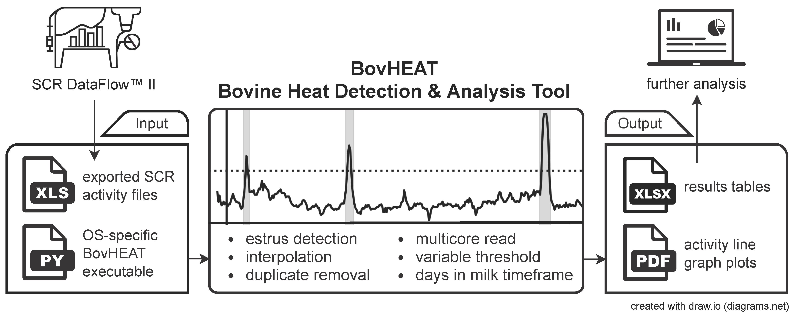
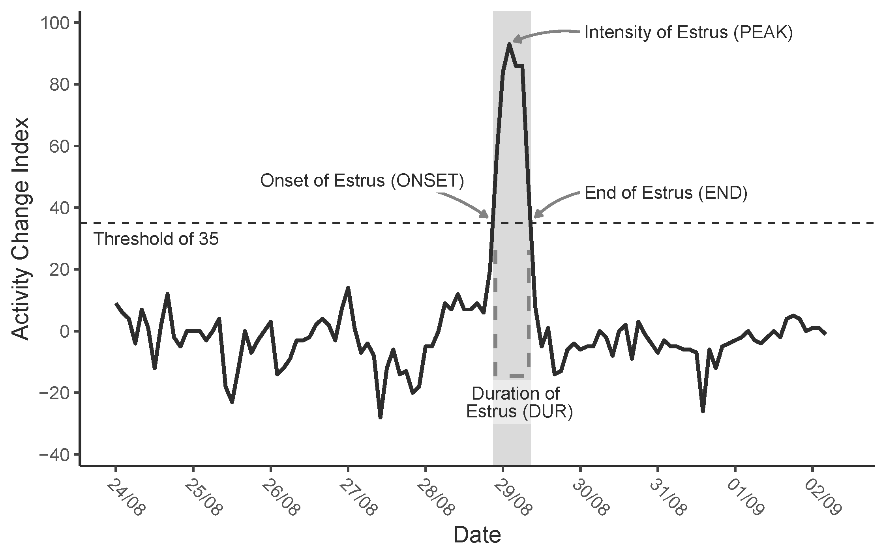
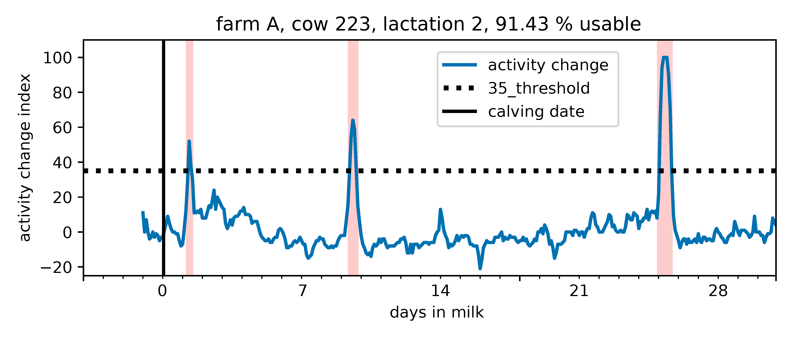

[](https://codecov.io/gh/bovheat/bovheat)
# BovHEAT

Bovine Heat Detection and Analysis Tool (BovHEAT) - Automated Heat detection and analysis tool for "SCR Heatime"
(SCR Engineers Ltd., Netanya, Israel) a neck-mounted accelerometer for automated activity monitoring in cows.
This tool analyses the raw data and performs error detection and correction. Additional data sources will be
supported in the future.

 <br>
We provide a one-file executable, which reads and processes SCR files automatically. 
The user can define the desired threshold for estrus detection and the observation period. 
Results are delivered as a wide and long formatted XLSX file and a PDF with activity line graph 
visualizations for each cow. <br>

<details>
<summary>Click here for a detailed heat description image</summary>

</details>

Table of Contents
=================

   * [BovHEAT](#bovheat)
  * [How to cite](#how-to-cite)
  * [Demo](#demo)
    * [Output](#output)
    * [Data](#data)
  * [Download and usage](#download-and-usage)
  * [Command-line options](#command-line-options)
  * [Requirements and constraints](#requirements-and-constraints)
    * [SCR file requirements](#scr-file-requirements)
    * [OS Requirements](#os-requirements)
  * [Development](#development)
     * [Optional/Extras](#optionalextras)


## How to cite
Plenio, J.-L., Bartel, A., Madureira, A. M. L., Cerri, R. L. A., Heuwieser, W., & Borchardt, S. (2021). *Application note: Validation of BovHEAT — An open-source analysis tool to process data from automated activity monitoring systems in dairy cattle for estrus detection.* **Computers and Electronics in Agriculture**, 188(September 2020), 106323. https://doi.org/10.1016/j.compag.2021.106323

## Demo

#### Output 
Example output as XLSX and PDF files can be examined at [example/output/](example/output/).
For this example an observation period of 5 days before till 30 days after calving was selected.
The estrus detection threshold was set at 35.

<details>
<summary>Click here for a line graph example from a pdf output file</summary>

</details>

#### Data
To try BovHEAT on your machine and generate the output for yourself, download the zipped example data
 from [example/output/data_zipped.zip](example/data/data_zipped.zip).
Run the BovHeat in parent folder according to the steps below. The column language is eng.

## Download and Usage

#### 1. Download
We provide a one-file executable for Windows, Linux and macOS.  
Download the zipped executable corresponding to your OS from the [latest BovHEAT release](https://github.com/bovheat/bovheat/releases/latest). 
#### 2. SCR files and folder structure
Place the BovHEAT executable in the folder containing SCR files in the XLSX or XLS format.
Alternatively, you can group SCR files in folders and put BovHEAT in the parent folder.
Cow IDs have to be unique in the data or unique within folders.
Therefore, we recommend you use one of the following two folder structures.
```
├── farm1                          OR           ├── farm1_scr_file1.xlsx 
│   ├── farm1_scr_file1.xlsx                    ├── farm1_scr_file2.xlsx 
│   └── farm1_scr_file2.xlsx                    ├── farm1_scr_file3.xlsx 
├── farm2                                       └── BovHEAT executable 
│   ├── farm2_scr_file1.xlsx    
│   └── farm2_scr_file2.xlsx    
└── BovHEAT executable         
```
#### 3. Run BovHEAT and select parameters
Execute BovHEAT, wait a few seconds for it to start and enter the following information.

`Column header language`  
Column language of the SCR files  

`Start and Stop DIM`  
Choose the start and stop DIM to select the observation interval.  
As an example: Start -5 and Stop 35 would include 5 days before till 35 days after calving.  

`Threshold`  
Choose the desired threshold for estrus detection. Recommended is a threshold of 35.  

`Minimum heat length`   
Choose a minimum number of heat observations required to count as a heat. Default is 1.

#### 4. Processing and results
Observe the progress on screen. Results are delivered as a wide and long formatted XLSX file and
a PDF file with activity line graph visualizations for each cow.

## Command-line options

BovHEAT starts in interactive mode, if startstop is not provided
```
positional arguments:
  relative_path         relative path to folder containing SCR xls(x) files

optional arguments:
  -h, --help            show this help message and exit
  -c CORES, --cores CORES
                        specify amount of logical cores to use, default 0: auto (max available-1),
                        1: disable multiprocessing, >1: fixed core amount
  -i [0-n], --interpolation_limit [0-n]
                        Maximum number of consecutive missing values to fill. 0 disables interpolation
  -l {ger,eng}, --language {ger,eng}
                        language of column headings, default=eng
  -m [0-100], --minheatlength [0-100]
                        minimum number of heat observations required to count as a heat, default=1
  -o OUTPUTNAME, --outputname OUTPUTNAME
                        specify output filename for result xlsx and pdf
  -s start-dim stop-dim, --startstop start-dim stop-dim
                        negative values are allowed
  -t [0-100], --threshold [0-100]
                        threshold for heat detection, default=35
  -x {dim,dt}, --x_axis_type {dim,dt}
                        show x-axis as datetime or dim in PDF, default=dim
```

## Requirements and constraints

#### SCR file requirements
The following columns are required to be present in all SCR files:
```
"Cow Number"
"Date"
"Time"
"Activity Change"
"Lactation Number"
"Days in Lactation"
```

#### OS Requirements 
The one-file executable of BovHEAT using x64 Python is built through GitHub Actions.
Therefore, the highest compatibility is achieved on these x64 OS versions and up:
```
macos-12
windows-2022
ubuntu-20.04
```


---


## Development
The authors recommend to use Python 3.8.18.  
To set up the development environment install [poetry](https://python-poetry.org/). And run:
```
poetry install
```

Start the program:
```
poetry run python bovheat_src/bovheat.py
```

### Optional/Extras
To install packages related to testing:
```
poetry install -E pytest-testing
```
Linting:
```
poetry install -E pylint
```
